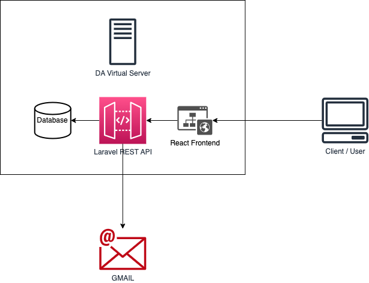
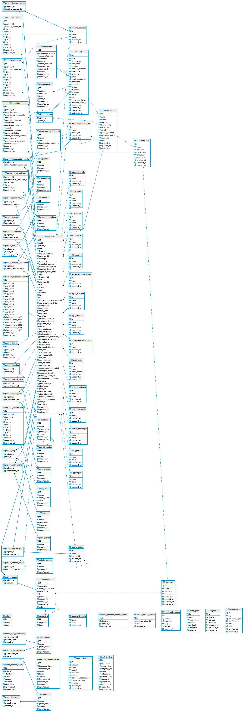

# <div style="text-align:center;">Public Investment Program System</div>

## <div style="text-align:center;">Consultant’s Report and System Documentation</div>

[TOC]

# Summary

From July to December 2022, in view of the upcoming formulation of the FY 2023-2028 Public Investment Program
and FY 2024-2026 Three-Year Rolling Infrastructure Program (TRIP), the Investment Programming Division (or IPD) 
engaged the services of the undersigned for the  updating of the existing Public Investment Program System (PIPS) 
that was used to facilitate the submission and review of programs and projects within the Department of Agriculture (DA) 
prior to submission to the National Economic and Development Authority (NEDA).

## 1. Background and Rationale

The Public Investment Program System (or PIPS) is a web-based database system designed to facilitate submission and
review of proposed and ongoing priority programs and projects of the operating units of the Department of Agriculture. 
It is designed to serve as a DA version of the PIP Online System (PIPOL System) of the National Economic and Development 
Authority (NEDA).

From July to December 2022, in view of the upcoming formulation of the FY 2023-2028 Public Investment Program
and FY 2024-2026 Three-Year Rolling Infrastructure Program (TRIP), the Investment Programming Division (or IPD)
engaged the services of the undersigned for the  updating of the existing Public Investment Program System (PIPS)
that was used to facilitate the submission and review of programs and projects within the Department of Agriculture (DA)
prior to submission to the National Economic and Development Authority (NEDA).

The system was developed from July 2022 - December 2022. The actual system development time spanned from July to 
October 2022 (four months) while the rest of time was spent on system and database administration, bug fixes,
introduction of new features, and documentation.

### Purpose

The objective of the PIPS is to facilitate the submission and review of priority programs 
and projects from the operating units. The validated data, in turn, is used as reference 
in the submission of inputs to the NEDA-PIPOL System.

Specifically, the system aims to:

1. 

## 2. Summary of Accomplishments

From July to December 2022, the consultant accomplished the following:

1. Review of the existing systems that can serve as model for the PIP System: the DA-Public Investment Program System 
(PIPS) and the NEDA-Public Investment Program Online System (PIPOL);
2. Design and implementation of the database for the PIPS;
3. Code the backend, frontend and manual applications of the PIPS based on the guidelines of the DA and the NEDA;
4. Deploy and maintain the applications in the DA server;
5. Provide inputs on the draft guidelines for the formulation of the 2023-2028 Public Investment Program and 2024-2026 
   Three-Year Rolling Infrastructure Program including recommendations in the review protocol for the PAPs;
6. Conduct series of user acceptance tests with the IPD staff;
7. Conduct series of training on the use of the system to DA operating units investment programming focals;
8. Performed administrative functions for the system such as enrolment of offices and users and sending of email 
   advisories to the DA OUs;
9. Participated in the review of the PAPs submitted in the PIPS; and
10. Extracted data encoded in the PIPOL System into HTML/JSON files for reference in reconciling the data of the DA 
   PIPS and NEDA PIPOL system.

### 3. Actual Outputs

The actual outputs of this engagement include:

1. PIPS Frontend available at https://pips.da.gov.ph
2. PIPS Backend available at https://api.pips.da.gov.ph
3. PIPS (User) Manual available at https://manual.pips.da.gov.ph
4. Documentation (this document)

In addition, the consultant also provided significant inputs in the Guidelines for the Formulation of FY 
2023-2028 Public Investment Program and FY 2024-2026 Three-Year Rolling Infrastructure Program.

Further, the consultant also developed a program to extract html files from the NEDA PIPOL System as well
as a program to extract the data in JSON format from said html files.

1. Extract PAP profile from PIPOL into html files: [https://colab.research.google.com/drive/1rb_gSd6fvvzfU1jokS0Tr-SFdL3Mvp8F?usp=sharing](https://colab.research.google.com/drive/1rb_gSd6fvvzfU1jokS0Tr-SFdL3Mvp8F?usp=sharing)
2. Extract PAP data from html files to JSON: [https://colab.research.google.com/drive/1S2q_IwyF-nrSyvdJGheFfeIMQNNO8uAr?usp=sharing](https://colab.research.google.com/drive/1S2q_IwyF-nrSyvdJGheFfeIMQNNO8uAr?usp=sharing)

## Scope of Work


## Development Process

## 3. Tools Used in the Development

#### Hardware/s
- Macbook Air M1 2020 / iMac 2017

#### Software/s
- PHPStorm by Jetbrains
- Webstorm by Jetbrains
- Visual Studio Code by Microsoft (used in iMac)
- Google Chrome / Microsoft Edge / Brave Browser
- Github
- DBeaver
- Terminal
- MySQL
- Laravel Valet
- Postman

#### Optional
- Docker Desktop

## 4. Software Architecture

The PIPS system adopts Single Page Application architecture powered by a Laravel REST API backend 
and React Frontend. This is shown in the image below:

<div style="text-align: center;">



**PIPS Software Architecture**

</div>

1. The backend, frontend and database are stored in the DA virtual server running Apache web server. 
The server serves the file to the internet. The backend is built using [Laravel](https://laravel.com).
2. The frontend serves as the entry point for client/users to the system. The frontend is build using [React](https://reactjs.org).
3. The backend interacts with the MySQL database to read/write data. The backend returns JSON response
to the frontend.
4. If email needs to be sent to the user, the backend accesses the GMail server to send the email.

## 5. Database Schema

PIPS is powered by the PostgreSQL server with PostgreSQL database.

```shell
[pips-user@localhost ~]$ psql --version
psql (PostgreSQL) 9.2.24
```

The entity relationship diagram is shown below.



### All Tables

| Name                          |  Rows |  Auto_increment | Comment                                                                            |
|-------------------------------|------:|----------------:|------------------------------------------------------------------------------------|
| activity_log                  |     0 |               1 | Table to store activity logs of users                                              |
| agencies                      |    18 |              20 | Table for agencies: OSEC, Attached Agencies and Attached Corporations              |
| agendas                       |     8 |               9 | Reference table for socioeconomic agenda                                           |
| announcements                 |     0 |               1 | Table to store site-wide announcements                                             |
| approval_levels               |     6 |             100 | Reference table for level of approval in NEDA                                      |
| bases                         |     7 |               8 | Reference table for basis for implementation                                       |
| categories                    |     4 |             100 | Reference table for categories based on 2TBA of DBM                                |
| checklists                    |     0 |               1 | Table for storing validation results                                               |
| cip_types                     |     9 |             100 | Reference table for typology of CIP                                                |
| colors                        |   373 |             374 | Table for colors in hex code                                                       |
| comments                      |     0 |               1 | Table for storing comments                                                         |
| commodities                   |    43 |              44 | Reference table for commodities                                                    |
| failed_jobs                   |     0 |               1 | Table for failed jobs                                                              |
| financial_accomplishments     |     0 |               1 | Table for financial accomplishments of PAPs: NEP, GAA, Disbursement                |
| fs_infrastructures            |     0 |               1 | Table for infrastructure cost per funding source                                   |
| fs_investments                |     0 |               1 | Table for investment cost breakdown per funding source                             |
| fs_statuses                   |     4 |             100 | Reference table for status of feasibility study                                    |
| funding_institutions          |    51 |              52 | Reference table for funding institutions                                           |
| funding_sources               |     7 |               8 | Reference table for funding sources                                                |
| gads                          |     5 |             100 | Reference table for level of gender and development responsiveness                 |
| implementation_modes          |     6 |             100 | Reference table for modes of implementation                                        |
| infrastructure_indicators     |    57 |              58 | Reference table for infrastructure indicators                                      |
| infrastructure_sectors        |    26 |              27 | Reference table for infrastructure sectors/subsectors                              |
| jobs                          |     0 |               1 | Table for queued jobs                                                              |
| locations                     |    99 |             100 | Reference table for regions and provinces                                          |
| migrations                    |     0 |                 |                                                                                    |
| model_has_permissions         |     0 |                 |                                                                                    |
| model_has_roles               |   232 |                 |                                                                                    |
| nafmip_outputs                |     7 |             100 | Reference table for NAFMIP outputs                                                 |
| notifications                 |     0 |                 | Table for notifications                                                            |
| oauth_access_tokens           |     0 |                 |                                                                                    |
| oauth_auth_codes              |     0 |                 |                                                                                    |
| oauth_clients                 |     0 |               1 |                                                                                    |
| oauth_personal_access_clients |     0 |                 |                                                                                    |
| oauth_refresh_tokens          |     0 |                 |                                                                                    |
| office_reviewer               |   115 |                 | Table for reviewers (IPD staff) assigned per office                                |
| offices                       |    59 |              60 | Table for storing offices (lower level OUs that submit PAPs to PIPS)               |
| operating_units               |    41 |              42 | Table for operating units based on PREXC structure                                 |
| password_resets               |     0 |                 | Table for password reset token                                                     |
| pdp_chapters                  |    25 |              26 | Reference table for chapters of the Philippine Development Plan                    |
| pdp_strategies                |    39 |             100 | Reference table for PDP strategies provided by PPD                                 |
| permissions                   |     0 |               1 |                                                                                    |
| personal_access_tokens        |     0 |               1 | Table for storing personal access tokens for Laravel Passport                      |
| pipol_statuses                |     6 |               7 | Reference table for status in the PIPOL System                                     |
| pips_statuses                 |     4 |               5 | Reference table for status of submission of PAP in PIPS                            |
| preparation_documents         |     6 |             100 | Reference table for project preparation documents                                  |
| prerequisites                 |    10 |              11 | Table for status of implementation readiness (under TRIP)                          |
| prexcs                        |   564 |             565 | Reference table for PREXC programs/subprograms/activities                          |
| programs                      |    15 |             100 | Table for banner programs under OSEC                                               |
| project_agenda                |     0 |                 | Table to store relationship between PAP and socioeconomic agenda                   |
| project_basis                 |     0 |                 | Table to store relationship between PAP and basis for implementation               |
| project_commodity             |     0 |                 | Table for storing relationship between PAP and commodity                           |
| project_funding_institution   |     0 |                 | Table to store relationship between PAP and funding institutions                   |
| project_funding_source        |     0 |                 | Table to store relationship between project and funding source                     |
| project_infra_indicator       |     0 |                 | Table to store relationship between PAP and infrastructure sector                  |
| project_infrastructure_sector |     0 |                 | Table for storing relationship between project and infrastructure sector/subsector |
| project_issues                |     0 |               1 | Table for automatically generated issues                                           |
| project_location              |     0 |                 | Table for storing relationship between project and location                        |
| project_nafmip_output         |     0 |                 | Table for storing relationship between PAP and NAFMIP outputs                      |
| project_operating_unit        |     0 |                 | Table for storing implementing units of PAPs                                       |
| project_pdp_chapter           |     0 |                 | Table for storing relationship between PAP and other PDP chapters                  |
| project_pdp_strategy          |     0 |                 | Table for storing relationship between PAP and PDP strategy                        |
| project_prerequisite          |     0 |                 | Table to store relationship between PAP and funding institutions                   |
| project_prexc                 |     0 |                 | Table for storing relationship between PAP and PREXC                               |
| project_sdg                   |     0 |                 | Table to store relationship between PAP and sustainable development goals          |
| project_statuses              |     3 |               4 | Reference table for status of PAP                                                  |
| project_vc_segment            |     0 |                 | Table to store relationship between PAP and value chain segment                    |
| projects                      |     0 |               1 | Table for programs and projects                                                    |
| readiness_levels              |     4 |               6 | Reference table for levels of implementation readiness                             |
| regional_investments          |     0 |               1 | Table for storing investment cost per region                                       |
| regions                       |     0 |               1 | Reference table for Philippine regions                                             |
| role_has_permissions          |     0 |                 |                                                                                    |
| roles                         |     5 |               6 |                                                                                    |
| sdgs                          |    17 |              18 | Reference table for sustainable development goals                                  |
| spatial_coverages             |     4 |               5 | Reference table for spatial coverage                                               |
| types                         |     2 |               3 | Reference table for PAP types                                                      |
| typologies                    |     5 |             100 | Reference table for typology of PIP                                                |
| users                         |   232 |             233 | Table for users                                                                    |
| vc_segments                   |     9 |              10 | Reference table for value chain segments                                           |

## 6. System Requirements
//

### 6.1 Server

The server hosting the application was provided by the Information and Communications Technology Service with the following details:

| Config Variable    | Value            |
|--------------------|------------------|
| Server Name        | DA-PIPS          |
| Operating System   | CentOS 7         |
| IP Address (Local) | 172.16.200.63    |
| Username:          | pips-user        |
| Password:          | 3vG$79wHNWvGh2ma |
| Public IP Address  | 115.146.161.188  |

The applications are hosted at DA on-premise powered by a CentOS 7 operating system with 4GB RAM and 100GB storage.

| Application    | URL                           | Tools Used                        |
|----------------|-------------------------------|-----------------------------------|
| Backend        | https://api.pips.da.gov.ph    | Laravel + combination of packages |
| Frontend       | https://pips.da.gov.ph        | React                             |
| Manual         | https://manual.pips.da.gov.ph | Docusaurus                        |
| Database       |                               | MySQL                             |
| Email Provider |                               | Gmail                             |
| Web server     |                               | Apache                            |
| Queueing       |                               | Supervisor                        |

The following services have been installed on the server:

1. [httpd](https://httpd.apache.org/) - The Apache HTTP Server is a free and open-source cross-platform web server software, released under the 
   terms of Apache License 2.0. Apache is developed and maintained by an open community of developers under the auspices of the Apache Software Foundation.
2. [postgresql](https://www.postgresql.org) - PostgreSQL, also known as Postgres, is a free and open-source relational database management system 
   emphasizing extensibility and SQL compliance. It was originally named POSTGRES, referring to its origins as a successor to the Ingres database developed at the University of California, Berkeley.
3. [supervisord](http://supervisord.org/) - Supervisor is a client/server system that allows its users to monitor and control a number of 
   processes on UNIX-like operating systems.
4. [Composer](https://getcomposer.org/) - Composer is a tool for dependency management in PHP. It allows you to declare the libraries your project depends on and it will manage (install/update) them for you.

### 6.2 Software Dependencies

For the backend, we also used the following packages to extend the functionalities of the application:

- **Laravel Excel (maatwebsite/excel)** - exporting project information to Excel file;
- **Laravel DomPDF (barryvdh/laravel-dompdf)** - exporting project profile to PDF;
- **Simple QrCode (SimpleSoftwareIO/simple-qrcode)** - generating QR code for project profile link;
- **JWT Auth (PHP-Open-Source-Saver/jwt-auth)** - generating JWT tokens for authenticating users in the REST API;
- **Nanoid-PHP (hidehalo/nanoid-php)** - generating short uuid for projects; and
- **TeamTNT Search Driver (teamtnt/laravel-scout-tntsearch-driver)** - add full-text search capabilities to the system.

For the frontend, we also used the following packages to extend the functionalities of React:

- **AntDesign** - ready-made components of user interface as well as charts.
- **Axios** - handle interaction with the Laravel application;
- **Copy to Clipboard** - copying data to clipboard; and
- **Moment** - handle manipulation of dates.

For the development environment, the following pieces of software were installed:

- Composer for managing dependencies of Laravel;
- Laravel Valet for local web server;
- MySQL server for database and DBeaver Community Edition for graphical user interface for database management; and
- Node and NPM for frontend development.

[Github](https://github.com) was used as the version control system with the following repositories:

| Application                                         | URL                                          |
|-----------------------------------------------------|----------------------------------------------|
| Backend                                             | https://github.com/mlab817/pipsv2.git        |   
| Frontend                                            | https://github.com/mlab817/pips-react.git    | 
| Manual                                              | https://github.com/mlab817/pips-docs.git     |

### 6.3 Recommended Competencies

1. Laravel Developer (experience working in REST API development is a plus).
2. React Developer with familiarity in responsive design (experience in using Ant Design is a plus).
3. Database management particularly PostgresQL.
4. Server management particularly CentOS 7.
5. Familiarity with investment programming is a plus.

## 7. Getting Started with Development

Install the following software:
- IDE of your choice - VS Code is recommended as it is free but PhpStorm and WebStorm are better. Make sure to 
install extensions to help in the development.
- PHP - server scripting language, and a powerful tool for making dynamic and interactive Web pages. This is needed 
  to run Laravel.
- Composer - package manager for PHP
- MySQL - database client
- NodeJS / npm / yarn - package manager for Node (used for frontend development)
- Git client - for version control

Tools like XAMPP/WAMP/Laragon can significantly reduce setup time. Alternative, Docker Desktop allows for a quicker setup as Laravel fully supports containerized development and deployment.

> Note: Installing PHP, composer, mysql and other tools manually via the command line serves as practice when 
> managing the application in the server.

To set up laravel, make sure the following PHP extensions are installed and enabled since they are not usually enabled by default:

- BCMath PHP Extension.
- Ctype PHP Extension.
- Fileinfo PHP extension.
- JSON PHP Extension.
- Mbstring PHP Extension.
- OpenSSL PHP Extension.
- PDO PHP Extension.

Additional PHP extensions may be needed by other Composer dependencies. For example, Laravel Excel requires 
another extension: `GD PHP`.

Clone the repositories into your local computer using Github. Open a terminal and type in the following. Press Enter 
after each line. You may install [Github desktop](https://desktop.github.com/) if you are not comfortable working with the command line.

> Fork the repository, so you won't have to request from the owner permission to modify/update the code.

```bash
cd /your-folder-of-choice
git clone git@github.com:<username>/<repository> <folder_name:optional>
cd <folder_name>
cp .env.example .env
composer install
php artisan key:generate
php artisan jwt:secret
```

Folder name is optional. By default, the folder the codes will be downloaded to is the name of the repository.

```bash
# configure the following variables in the .env file
APP_NAME=<your app name>
DB_CONNECTION=
DB_HOST=
DB_PORT=
DB_DATABASE=
DB_USERNAME=
DB_PASSWORD=
```

```bash
php artisan migrate --seed
php artisan serve
```

### Code Organization

The code for PIPSv2 follow the default Laravel directory, so you can learn more about it from the [Laravel website]
(https://laravel.com).

An exemption is the `app/helper.php` which contains functions that can be called anywhere from the code.

Since the app is a REST backend, you would find the routing inside `routes/api.php`. The resourceful pattern was 
used as much as possible. Controllers can be found in `app/http/controllers/api/v1` folder. For the requests, they 
are validated using the files in the `app/http/requests` directory while responses are formatted using the resources 
folder in the `app/http/resources`. Some tests were written in the `tests/` folder, but they were not updated due to 
the short time allotted for development.

The app configurations can be found in `config` directory. You may not need to modify the rest of the files/folders 
in the code.

The `database/` folder contains the factories (generating data for testing), migrations (scripts for creating, 
updating, and deleting tables), and seeders 
(default data).

To summarize, you only need to modify the following files/folders as some are autogenerated:

1. `app/`
2. `config/`
3. `database/`
4. `routes/`
5. `.env`

### Connecting to the Server

To connect to the server, you need to connect via SSH. Follow the steps below when using MacOS:

Install an OpenSSH client.
Open a terminal and type in the following command and press enter:

ssh <username>@<server.ip>
replacing <username> and <server.ip> with the actual values from server credentials.

Type in the password once prompted and press Enter.

If login is successful, you are now connected to the server.

You can also read more here: https://phoenixnap.com/kb/ssh-to-connect-to-remote-server-linux-or-windows.

### Connecting to database

Why?

1. Download **DBeaver Community Edition** from https://dbeaver.io/download/. Select 
   the appropriate version based on your computer’s operating system (i.e. Windows, Linux, MacOS).

> Note: Other database tools, e.g. MySQL workbench can also be used to connect to the database. DBeaver was chosen 
 due to its user-friendly interface.

2. After downloading the installer, install the application.

3. Open the application. Click on the **Database** in the menu bar, then, **New Database Connection**. Select **MySQL** as the 
database and click Next. Enter the following information in the **Connection Settings**:

```
Server Host: 
   172.16.200.63 (if connected to the DA network) OR 
   115.146.161.188 (if using an external network)
Port: 3306
Database: pips
Username: root
Password: DAIPD@012345
```

4. Lastly, click **Finish**. If successful, the pips database will now appear in the sidebar Database Navigator. If 
   that did not work, proceed to Troubleshooting.

> Note that connecting to database server will not work when you are not connected to DA network.

#### Troubleshooting Database Connection

1. Download required drivers.
2. Create a remote user and add your IP address.
3. Make sure the server is online and accessible.

#### Querying the Database

The syntax used in querying the database for reports vary depending on the database driver used.
Since the database used by the application is PostgreSQL, the sql scripts below are written in PostgreSQL.

Here are a few things to look out for when generating reports:

1. **Use projects table as source of truth**. All reports should refer to the `projects` table since the status of PAPs 
   can affect 
   the 
   report generated.
2. **Be mindful of soft deletion**. Deleted At - the `projects.deleted_at IS NULL` should always be included since 
   non-empty 
   column indicates the PAP 
   has already been deleted regardless of the status in PIPS, PIPOL and validation.
3. **Be mindful of PIPS status.** - the `projects.pips_status_id` must be set to `2 
   (finalized)`.
4. **Be mindful of validation status** - the `projects.passes_validation` must be set to `1 (Passed)` 
   for indicative 
   PIPOL submission.
5. **Be mindful of PIPOL status** - the `projects.pipol_status_id` must be set to `2 (IPD:ENDORSED)` for 
   official data.

Where to get data:

- For investments

1. `fs_investments` table contains the breakdown of investment requirements per funding source
2. `regional_investments` table contains the breakdown of investment requirements per region

Note: Rely on fs_investments for any statistics regarding total cost. Regional investments may not be accurate
as the information may not be available at the time of encoding and thus may be incomplete.

- Project-specific information (`projects` table)

1. `type_id` if program or projects
2. `regular_program` if regular program or not
3. `project_status_id` if ongoing, completed
4. `category_id` for 2TBA classification
5. `pdp_chapter_id` for the main PDP chapter the PAP contributes to
6. `spatial_coverage_id` for the spatial coverage
7. `typology_id` for typology of PIP
8. `cip_type_id` for type of CIP
9. `pip` if PIP or not
10. `trip` if TRIP or not
11. `cip` if CIP or not
12. `rdip` if RDIP or not
13. `funding_source_id` for main funding source
14. `readiness_level_id` for level of readiness

- Tagging

1. `project_sdg` for SDG indicators
2. `project_agenda` for socioeconomic agenda
3. `project_pdp_chapter` for other PDP chapters
4. `project_infra_sector` for infrastructure sectors/subsectors
4. `project_infra_indicator` for infrastructure indicators (TRIP only)
5. `project_basis` for basis for implementation
6. `project_location` for provinces
7. `project_commodity` for commodities
8. `project_vc_segment` for value chain segments
9. `project_pdp_strategy` for PDP/MYP strategy
10. `project_funding_source` for funding sources
11. `project_funding_institution` for funding institutions
12. `project_nafmip_output` for NAFMIP outputs

> Note: For tagging of regions, refer to `regional_investments` table.

##### Sample Queries

- Query to get annual breakdown for PIPOL endorsed PAPs only

```sql
select
    sum(y2023) as "y2023",
    sum(y2024) as "y2024",
    sum(y2025) as "y2025",
    sum(y2026) as "y2026",
    sum(y2027) as "y2027",
    sum(y2028) as "y2028",
    sum(y2023+y2024+y2025+y2026+y2027+y2028) as "TOTAL"
from fs_investments fi
where project_id in (
    select id
    from projects
    where pipol_status_id = 2
);
```

- Query to extract data for breakdown per funding source for PIPOL endorsed PAPs only

```sql
select 
	fs.name as "FUNDING SOURCE",
	sum(y2023) as "y2023",
	sum(y2024) as "y2024",
	sum(y2025) as "y2025",
	sum(y2026) as "y2026",
	sum(y2027) as "y2027",
	sum(y2028) as "y2028",
	sum(y2023+y2024+y2025+y2026+y2027+y2028) as "TOTAL"
from fs_investments fi
join funding_sources fs  on fs.id = fi.funding_source_id 
where project_id in (
	select id
	from projects
	where pipol_status_id = 2
)
group by fs.id
order by fs.id;
```

- Query to get annual breakdown per region for PIPOL endorsed PAPs only

```sql
select 
	r.name as "REGION",
	sum(y2023) as "y2023",
	sum(y2024) as "y2024",
	sum(y2025) as "y2025",
	sum(y2026) as "y2026",
	sum(y2027) as "y2027",
	sum(y2028) as "y2028",
	sum(y2023+y2024+y2025+y2026+y2027+y2028) as "TOTAL"
from regional_investments ri
join regions r  on r.id = ri.region_id 
where project_id in (
	select id
	from projects
	where pipol_status_id = 2
)
group by r.id
order by r."order";
```

### Setting up email provider

To send email to users such as reset password email and system advisories, Gmail is used as email provider to PIPS 
backend. To set up, follow the steps below:

1. Go to the Security section in your GMail Account. You can visit this link directly: https://myaccount.google.
   com/security?hl=en.
2. Enable 2-Step verification. 
3. Go to App passwords.
4. Choose "Others" in the Select App dropdown and enter the name of the application.
5. Copy the app password.

The credentials used for the system is:

| Attribute      | Value                 |
|----------------|-----------------------|
| Email          | dapipsystem@gmail.com | 
| Password       | D@1PD2022#            |
| Recovery Email | ipd@da.gov.ph         |

Below are backup codes to bypass 2-step verification:


> You should not disable two-step verification as it is required in using Gmail as email provider.

## 8. Deployment

The following are the steps needed to deploy the application in a CentOS server.

1. Install Apache:

```bash
sudo yum install httpd
```

To set up, follow the instructions provided here: https://www.digitalocean.
com/community/tutorials/how-to-install-the-apache-web-server-on-centos-7

Make sure you set up Virtual Hosts for the application.

> Note: You need to request the DA-ICTS to enable the domain names in the server; otherwise, the URL will throw
> DNS Server not found.

Following is an example of working VirtualHost configuration:

```apacheconf
<VirtualHost *:80>
ServerAdmin webmaster@pips.da.gov.ph
ServerName pips.da.gov.ph
ServerAlias pips.da.gov.ph www.pips.da.gov.ph

    DocumentRoot /var/www/pips.da.gov.ph/dist
    <Directory /var/www/pips.da.gov.ph/dist>
	Options +Indexes +Includes +FollowSymLinks +MultiViews
	AllowOverride All
	Require all granted
    </Directory>

    ErrorLog /var/www/log/error.log
    CustomLog /var/www/log/requests.log combined

    RewriteEngine on

    RewriteCond %{REQUEST_FILENAME} !.well-known/
    RewriteRule "(^|/)\.(?!well-known)" - [F]

    RewriteCond %{SERVER_NAME} =www.pips.da.gov.ph [OR]
    RewriteCond %{SERVER_NAME} =pips.da.gov.ph
    RewriteRule ^ https://%{SERVER_NAME}%{REQUEST_URI} [END,NE,R=permanent]
</VirtualHost>
```

2. Install php.

```bash
sudo yum install php
```

Enable php packages required by Laravel.

- BCMath PHP Extension.
- Ctype PHP Extension.
- Fileinfo PHP extension.
- JSON PHP Extension.
- Mbstring PHP Extension.
- OpenSSL PHP Extension.
- PDO PHP Extension.

View more here: https://linuxstans.com/how-to-install-php-centos/

3. Install composer.

```bash
php -r "copy('https://getcomposer.org/installer', 'composer-setup.php');"
php -r "if (hash_file('sha384', 'composer-setup.php') === '55ce33d7678c5a611085589f1f3ddf8b3c52d662cd01d4ba75c0ee0459970c2200a51f492d557530c71c15d8dba01eae') { echo 'Installer verified'; } else { echo 'Installer corrupt'; unlink('composer-setup.php'); } echo PHP_EOL;"
php composer-setup.php
php -r "unlink('composer-setup.php');"
```

Move the composer to the `/usr/bin` so you can easily access them using the command line.

```bash
sudo mv composer.phar /usr/local/bin/composer
```

4. Install PostgresQL

```
sudo yum install mariadb-server
```

> Note: mysql installation is different from mysql-server. Unfortunately, mysql-server is no longer available
> so mariadb-server is used instead. For the setup, visit this url: https://linuxize.com/post/install-mariadb-on-centos-7/

5. Install supervisord.

6. Install git

```
sudo yum install git
```

> Note: Add an SSH key to your Github account to be able to access your github account via command line.
> You may follow the instructions here: https://docs.github.com/en/authentication/connecting-to-github-with-ssh

7. Clone the repository using the command below:

```bash
git clone git@github.com:<username>/<repository> <folder_name>
```

Replace username with your github username, repository with the project repository, and the folder_name to the 
destination folder. You can also leave the folder_name blank and the folder will default to repository.

Example:

```bash
git clone git@github.com:mlab817/pipsv2.git pips
```

8. Install the dependencies.

```shell
cd <folder_name>
composer install
```

> Note: `composer install` is preferred over `composer updated` as composer update can update some 
> dependency versions and may cause version conflicts.

9. Configure the application.

```bash
# copy the env file
cp .env.example .env
```

After copying the `.env`, run the following commands:

```bash
# generate the app key
php artisan key:generate

# generate the JWT secret
php artisan jwt:secret

# create a symbolic link for the storage folder to the public folder to be able to be 
# accessed over the network
php artisan storage:link
```

Next, configure the `.env` file particularly the following:

```
# the command above will copy the existing env.example and rename it to .env
# open the file to edit
vi .env


APP_NAME=
APP_URL=

# enter MySQL credentials 
DB_CONNECTION=mysql
DB_HOST=localhost
DB_PORT=3306
DB_DATABASE=<name of database>
DB_USERNAME=<username>
DB_PASSWORD=<password>

# If you want to queue the jobs, set this to database. Else use sync.
QUEUE_DRIVER=database
```

10. Finish the backend setup.

```bash
php artisan migrate:fresh --seed # only run this command on development mode
php artisan optimize # cache files to speed up the app
```

11. Open the URL of the backend to verify if the setup worked correctly.

## Users and Roles

1. Investment Programming Division

   The Investment Programming Division (or IPD) acts as the `owner` of the PIPS. As such it manages the offices, endusers
   and projects in the PIPS.

   Overall system administration also belongs to the IPD.

2. Bureau of Agriculture and Fisheries Engineering

   The Bureau of Agriculture and Fisheries Engineering (or BAFE) acts as a `TRIP reviewer` for projects in the PIPS.

3. DA Operating Units 

   DA Operating Units (consisting of OSEC Service Units, Banner Programs, Project Offices, Regional Field Offices, 
   Attached Agencies, and Attached Corporations) acts as `encoders` of projects in the System.

## Challenges Encountered

### Development Aspect

1. Late development of the PIP/TRIP guidelines that impacted the timeline of the development, e.g. data fields,
    submission flow, review protocols
    - data fields were not complete
2. Difficulty in setting up the server (steep learning curve moving from Z.com Shared Hosting to DA Virtual Private 
   Server)
3. Lack of performant development machine (the developer used personal computer)
4. The system design can be enhanced by documenting actual usage of the system. Unfortunately, due to the short
   time allotted for the actual formulation of the PIP/TRIP, the staff took a lot of shortcuts in the process (e.g.
   direct encoding to the PIPOL system prior to obtaining final approval of the validation).

### Implementation Aspect

1. The biggest challenge is the availability of staff that can provide inputs on the design of the system. A lot of 
   the features were `improvised` by the developer. At the time that the staff requested for additional features, 
   it was one month away before full deployment.
2. The developer served as the admin for the system that manages the `directory` and the `users` as well as `email` 
   advisories. The developer also performed tasks such as a) user trainer, and  b) actual review of PAPs.
3. Some users did not follow protocols on the use of the system such as:
   - Sharing of credentials
   - Not providing all required inputs
   - Not filling up the review fields properly
   - Not updating the status of submission
4. Gap in coordination mechanisms with other offices, e.g. PDS and SPCMAD, since they are not covered by the system.
5. The need for a better definition of what "programs and projects" should be submitted to the PIPS and the PIPOL.
   Many of the OU focal persons submitted activity/intervention/indicator-level inputs to the PIPS leading to a lot of
   PAPs being dropped during the encoding and validation process.

## Ways Forward

1. Build an admin-dedicated user interface to manage the different reference tables for the programs/projects profile.
2. Hire dedicated staff with the required competencies to upgrade and maintain the PIPS applications, server and 
   database.


